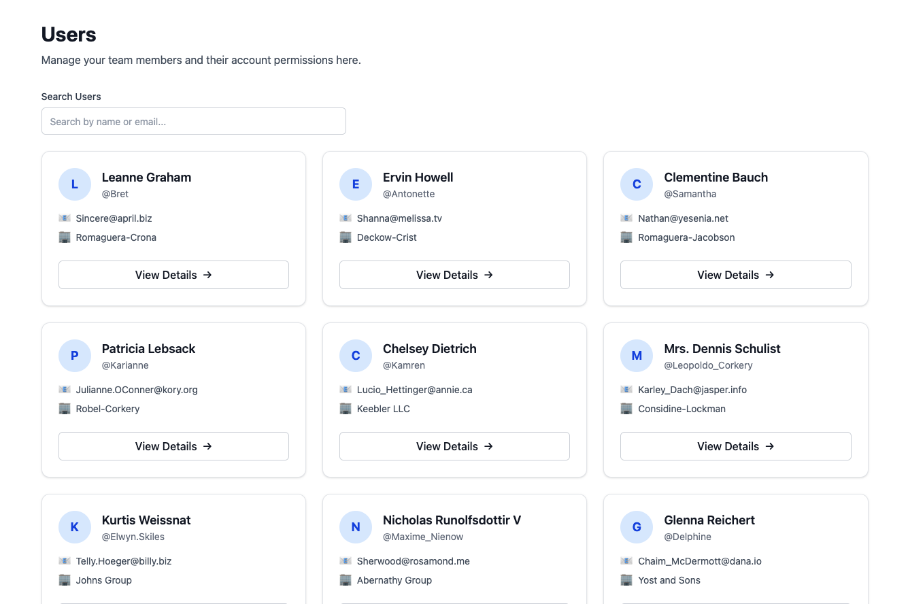

<div align="center">
  <h1>User Management Dashboard</h1>


  <br>
  
  <br>
  <br>
  <p>Application to visualize and manage users via a public API, built with <strong>React</strong>, <strong>TypeScript</strong>, <strong>Vite</strong>, and <strong>Tailwind CSS</strong>.</p>
  <p><strong><a href="https://sfe-ebooking.vercel.app/" target="_blank" rel="noopener noreferrer">🚀 Live Demo</a></strong></p>
  <br>
</div>

## **📖 Description**

This project is a comprehensive User Management Dashboard designed for efficiency and ease of use. It allows administrators to view, filter, and manage user data retrieved from a public API. Key features include real-time search, detailed user profiles, and a responsive design tailored for all devices.

---

## ⚡ Quick Start

```bash
# 1. Install Bun (if not installed)
curl -fsSL https://bun.sh/install | bash

# 2. Clone the repository
git clone git@github.com:david-portilla/sfe-ebooking.git
cd sfe-ebooking

# 3. Install dependencies
bun install

# 4. Start development server
bun dev

# 5. Open http://localhost:5173 in your browser 🎉
```

**That's it!** No environment variables needed, no additional setup required.

---

## **🚀 Live Demo**

Check out the live version of the app:
👉 [sfe-ebooking.vercel.app](https://sfe-ebooking.vercel.app/)

## 📋 Prerequisites

Before you begin, ensure you have the following installed:

### Required

- **Bun** v1.0.0 or higher ([Installation Guide](https://bun.sh/docs/installation))

  ```bash
  # macOS/Linux
  curl -fsSL https://bun.sh/install | bash

  # Windows (PowerShell)
  powershell -c "irm bun.sh/install.ps1 | iex"

  # Verify installation
  bun --version
  ```

- **Git** (for cloning the repository)

### Optional

- **Node.js** v18+ (recommended for better IDE compatibility)

---

## 🚀 Tech Stack

- **Runtime**: [Bun](https://bun.sh)
- **Framework**: [React](https://react.dev) + [Vite](https://vitejs.dev)
- **Styling**: [Tailwind CSS v4](https://tailwindcss.com) & [React Aria](https://react-spectrum.adobe.com/react-aria/index.html)
- **State Management**: [TanStack Query](https://tanstack.com/query) (Server State)
- **Routing**: [React Router v7](https://reactrouter.com)
- **I18n**: [i18next](https://www.i18next.com)
- **Quality**: ESLint, Prettier, Husky, Commitlint, Vitest

## 🛠️ Setup & Run

### 1. Clone the Repository

```bash
# HTTPS
git clone https://github.com/david-portilla/sfe-ebooking.git

# SSH (if you have SSH keys configured)
git clone git@github.com:david-portilla/sfe-ebooking.git

cd sfe-ebooking
```

### 2. Install Dependencies

```bash
bun install
```

### 3. Environment Setup (Optional)

This project uses a public API and **doesn't require environment variables**. The API endpoint is hardcoded to:

```
https://jsonplaceholder.typicode.com/users
```

For future configuration needs, you can create a `.env` file:

```bash
# No .env file needed for basic usage
# All configuration is optional
```

### 4. Start Development Server

```bash
bun dev
```

The app will be available at [http://localhost:5173](http://localhost:5173)

### 5. Build for Production

```bash
bun run build
```

### 6. Preview Production Build

```bash
bun run preview
```

---

## 📜 Available Scripts

| Command                | Description                                | When to Use        |
| ---------------------- | ------------------------------------------ | ------------------ |
| `bun dev`              | Start dev server (port 5173)               | Daily development  |
| `bun run build`        | Production build                           | Before deployment  |
| `bun run preview`      | Preview production build                   | Test build locally |
| `bun run test`         | Run tests in watch mode                    | TDD workflow       |
| `bun run test:run`     | Run tests once (CI mode)                   | Pre-commit checks  |
| `bun run lint`         | Check for linting errors                   | Before committing  |
| `bun run lint:fix`     | Auto-fix linting errors                    | Clean up code      |
| `bun run format`       | Format code with Prettier                  | Manual formatting  |
| `bun run check-format` | Check if code is formatted                 | CI pipeline        |
| `bun run check-all`    | Run all checks (lint, format, test, build) | **Before pushing** |
| `bun run prepare`      | Install Husky git hooks                    | After fresh clone  |

**💡 Pro tip**: Run `bun run check-all` before committing to catch issues early!

## 📁 Project Structure

```
sfe-ebooking/
├── .github/
│   └── workflows/
│       └── ci.yml              # GitHub Actions CI/CD pipeline
├── .husky/                     # Git hooks (pre-commit, commit-msg)
├── src/
│   ├── app/                    # Application-level setup
│   │   ├── provider.tsx        # Root providers (QueryClient, Router)
│   │   └── router.tsx          # Route definitions (React Router v7)
│   ├── components/
│   │   └── ui/                 # Reusable, accessible UI components
│   │       ├── button.tsx      # Button with variants (primary, ghost, etc.)
│   │       ├── input.tsx       # Input with validation & error states
│   │       ├── card.tsx        # Card container with hover effects
│   │       └── layout.tsx      # Layout utilities (Container)
│   ├── features/               # Feature modules (self-contained)
│   │   └── users/              # Users feature
│   │       ├── api.ts          # API calls with error handling
│   │       ├── api.test.ts     # API unit tests (100% coverage)
│   │       ├── types.ts        # TypeScript interfaces (User, Address, etc.)
│   │       ├── hooks/          # Custom hooks (useUsers, useUser)
│   │       └── components/     # Feature-specific components
│   ├── lib/                    # Shared utilities & configurations
│   │   ├── i18n.ts             # i18next setup (en/es support)
│   │   ├── query-client.ts     # TanStack Query configuration
│   │   ├── url-utils.ts        # URL sanitization (XSS prevention)
│   │   └── utils.ts            # Helper functions (cn, clsx)
│   ├── pages/                  # Page-level components
│   │   ├── UsersPage.tsx       # User list with search & filters
│   │   └── UserDetailPage.tsx  # User detail view
│   ├── test/                   # Test setup & utilities
│   │   ├── setup.ts            # Vitest setup (jest-dom)
│   │   └── integration/        # Integration tests
│   └── main.tsx                # Application entry point
├── bun.lockb                   # Bun lockfile (DO NOT EDIT MANUALLY)
├── package.json                # Dependencies & npm scripts
├── vite.config.ts              # Vite configuration (Vitest setup)
├── tsconfig.json               # TypeScript configuration (strict mode)
├── eslint.config.js            # ESLint rules (TypeScript + React)
├── vercel.json                 # Vercel deployment config (headers, caching)
├── commitlint.config.js        # Commit message validation rules
└── CLAUDE.md                   # Project documentation for Claude Code
```

## ✨ Features

### Functional

- 👥 **User Directory**: View a list of users with key details (avatar, email, company).
- ⚡ **Optimized Performance**: Server-state management for instant data access.

### Technical

- ✅ **Feature-based architecture** for scalability
- ✅ **React Aria Components** for WCAG 2.1 AA accessibility
- ✅ **TanStack Query** for efficient server state management
- ✅ **Vitest + React Testing Library** with 14+ tests
- ✅ **TypeScript strict mode** for type safety
- ✅ **Comprehensive error handling** (ApiError class)
- ✅ **Automated quality checks** (ESLint, Prettier, Husky hooks)
- ✅ **CI/CD pipeline** via GitHub Actions
- [x] **Internationalization** ready (i18next)

## 🔮 Future Improvements

While the current version meets all technical requirements, here are some planned enhancements:

- **Pagination**: Implement server-side or client-side pagination to handle larger datasets efficiently.
- **Dark Mode**: Add a theme toggler to switch between light and dark modes.
- **User Management**: Implement **Create**, **Update**, and **Delete** actions (CRUD) to fully utilize the API capabilities.
- **Map Integration**: Replace the static coordinates in the User Detail view with an interactive map (e.g., Leaflet or Google Maps).
- **Advanced Filtering**: Add filters for company or city to refine user searches further.

### 🏗️ Technical Debt & Performance Roadmap

This section outlines known optimizations and reliability improvements planned for the next iteration to ensure scalability:

- **🎯 Performance Monitoring**: Integrate Web Vitals tracking and Sentry for real-time error monitoring.
- **⚡ Code Splitting**: Implement lazy loading for routes and heavy components to optimize initial load time.
- **🛡️ Error Boundaries**: Add granular React Error Boundaries to prevent full app crashes.
- **🤖 E2E Testing**: Add Playwright or Cypress for complete end-to-end user flow validation.
- **🌍 Full Internationalization**: Complete i18n support for all user-facing text.

## 🧪 Testing

The project uses **Vitest** with **React Testing Library**:

- **Unit tests**: API layer, utility functions
- **Component tests**: UI components with accessibility checks
- **Coverage**: 14 tests across 4 test files
- **Pattern**: Tests are colocated with source files (`.test.ts`, `.test.tsx`)

Run tests:

```bash
bun run test      # Watch mode - runs tests on file changes
bun run test:run  # CI mode - single run with coverage
```

## 🎨 UI Components

All UI components are built with **React Aria Components** for accessibility:

- `Button` - Multiple variants (primary, secondary, outline, ghost, danger) and sizes
- `Input` - Text fields with labels, descriptions, and error states
- `Card` - Content container with hover effects
- `Layout` - Page layout utilities

Components support:

- Keyboard navigation
- Screen reader compatibility
- Focus management
- ARIA attributes
- Render props for advanced styling

---

## 🔧 Troubleshooting

### Common Issues

#### ❌ `bun: command not found`

**Solution**: Install Bun first (see [Prerequisites](#-prerequisites) section)

#### ❌ Port 5173 already in use

**Solution**:

```bash
# Kill the process using port 5173
lsof -ti:5173 | xargs kill -9

# Or use a different port
bun dev --port 3000
```

#### ❌ `Cannot find module` errors

**Solution**: Delete `node_modules` and reinstall

```bash
rm -rf node_modules bun.lockb
bun install
```

#### ❌ Tests failing with "fetch is not defined"

**Solution**: This is expected - use `bun run test` (Vitest), **NOT** `bun test` (Bun's native runner)

```bash
# ❌ Wrong - uses Bun's test runner
bun test

# ✅ Correct - uses Vitest
bun run test
```

#### ❌ Git hooks not running (Husky)

**Solution**: Reinstall Husky hooks

```bash
bun run prepare  # Reinstalls git hooks
```

#### ❌ Commit rejected: "commit message doesn't match format"

**Solution**: Follow the commit message convention:

```bash
# Format: type(scope): [TICKET-ID] message
git commit -m "feat(users): [SFE-005] add user search"
```

Valid types: `feat`, `fix`, `docs`, `style`, `refactor`, `test`, `chore`

#### ❌ `bun install` fails or hangs

**Solution**:

```bash
# Clear Bun cache
rm -rf ~/.bun/install/cache

# Try again
bun install
```

---

## 🤝 Contributing

We follow a strict Git workflow. Please read these guidelines before contributing:

### Branch Naming Convention

- **Format**: `SFE-XXX-feature-name`
- **Example**: `SFE-005-user-search`

### Commit Message Format

- **Format**: `type(scope): [TICKET-ID] message`
- **Example**: `feat(users): [SFE-005] add search filtering`
- **Enforced by**: commitlint (via Husky commit-msg hook)

**Valid types**:

- `feat` - New feature
- `fix` - Bug fix
- `docs` - Documentation changes
- `style` - Code style changes (formatting, etc.)
- `refactor` - Code refactoring
- `test` - Adding or updating tests
- `chore` - Maintenance tasks

### Git Workflow

1. **Never commit directly to `main`**
2. Create a feature branch from `main`:
   ```bash
   git checkout -b SFE-XXX-your-feature
   ```
3. Make your changes with proper commit messages
4. Run quality checks before pushing:
   ```bash
   bun run check-all
   ```
5. Push to your branch:
   ```bash
   git push origin SFE-XXX-your-feature
   ```
6. Open a Pull Request to `main`

### Pre-commit Hooks

Husky will automatically run before each commit:

- ✅ ESLint on staged files
- ✅ Prettier formatting
- ✅ Commit message validation

If hooks fail, fix the issues and commit again.

### Testing Requirements

All PRs must include appropriate tests:

- Unit tests for new utility functions
- Component tests for UI changes
- Integration tests for user flows

Run tests before submitting:

```bash
bun run test:run  # Run all tests once
```

---

## 📄 License

This project is licensed under the **MIT License** - see the [LICENSE](LICENSE) file for details.

---

## 👥 Authors

- **David Portilla** - [GitHub](https://github.com/david-portilla)

---

## 🙏 Acknowledgments

- API provided by [JSONPlaceholder](https://jsonplaceholder.typicode.com/)
- UI components built with [React Aria](https://react-spectrum.adobe.com/react-aria/)
- Testing utilities from [Testing Library](https://testing-library.com/)
- Icons from [Lucide React](https://lucide.dev/)

---

## 📞 Support

If you encounter any issues or have questions:

1. Check the [Troubleshooting](#-troubleshooting) section
2. Search [existing issues](https://github.com/david-portilla/sfe-ebooking/issues)
3. Open a [new issue](https://github.com/david-portilla/sfe-ebooking/issues/new) with detailed information

---

<div align="center">
  Made with ❤️ by <a href="https://github.com/david-portilla">David Portilla</a>
</div>
